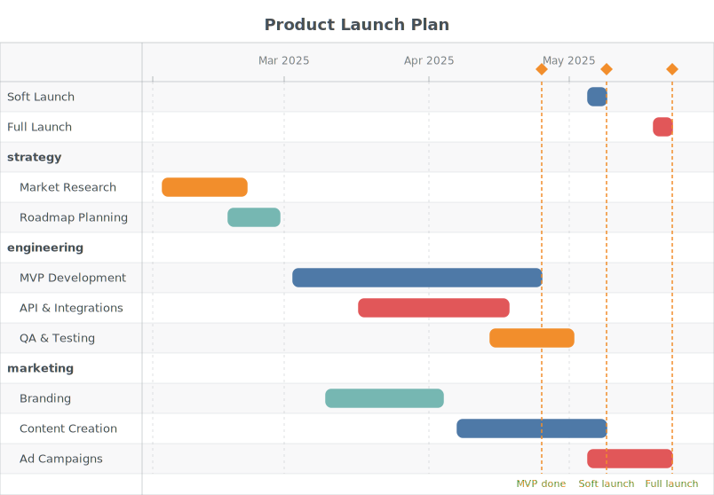

# ai-figure

> Clean SVG diagram renderer — define config, get beautiful diagrams. Works in browser **and** Node.js.

[](https://www.npmjs.com/package/ai-figure)
[](https://github.com/hustcc/ai-figure/actions/workflows/build.yml)
[](LICENSE)

|  |  |  |
|:---:|:---:|:---:|
| Flow | Tree | Architecture |

|  |  |  |
|:---:|:---:|:---:|
| Sequence | Quadrant | Gantt |

## Features ✨

- 🎨 **Rich visual styles** — light/dark mode, six built-in product-inspired palettes (`default`, `antv`, `drawio`, `notion`, `figma`, `github`) plus custom hex arrays; every diagram supports optional title & subtitle, node groups, and color-coded layers
- 📐 **Auto layout** — just describe the graph; x/y coordinates are computed automatically, and diagram dimensions scale to fit the content
- 🤖 **AI-friendly** — single `fig()` entry point, unified semantic JSON config, TypeScript-first; ships a [`SKILL.md`](./SKILL.md) that AI agents (Copilot, Cursor, Claude, etc.) can load as context
- 📊 **6 diagram types** — flowchart, tree, architecture, sequence, quadrant, and Gantt chart; pure SVG output with zero DOM dependency, works in browser and Node.js

---

## Quick Start

### Install

```bash
npm install ai-figure
```

### Usage

```typescript
import { fig } from 'ai-figure';

// Flowchart
const svg = fig({
  figure: 'flow',
  nodes: [
    { id: 'start',    label: 'Start',        type: 'terminal' },
    { id: 'process1', label: 'Process Data', type: 'process'  },
    { id: 'decision', label: 'Is Valid?',    type: 'decision' },
    { id: 'end_yes',  label: 'Success',      type: 'terminal' },
    { id: 'end_no',   label: 'Failure',      type: 'terminal' },
  ],
  edges: [
    { from: 'start',    to: 'process1'              },
    { from: 'process1', to: 'decision'              },
    { from: 'decision', to: 'end_yes', label: 'Yes' },
    { from: 'decision', to: 'end_no',  label: 'No'  },
  ],
  groups: [
    { id: 'g1', label: 'Validation', nodes: ['process1', 'decision'] },
  ],
  theme: 'light',         // 'light' | 'dark'
  palette: 'default',     // 'default' | 'antv' | 'drawio' | 'notion' | 'figma' | 'github' | string[]
  direction: 'TB',        // 'TB' (top→bottom) | 'LR' (left→right)
});

// Browser: inject into the DOM
document.body.innerHTML = svg;

// Node.js: write to file
import { writeFileSync } from 'fs';
writeFileSync('diagram.svg', svg);
```

---

## API Reference

### `fig(options): string`

The single entry point. Returns a fully self-contained SVG string. Select the diagram type with the required `figure` field.

```typescript
import { fig } from 'ai-figure';

fig({ figure: 'flow',     ...flowOptions     }); // flowchart
fig({ figure: 'tree',     ...treeOptions     }); // tree / hierarchy
fig({ figure: 'arch',     ...archOptions     }); // architecture diagram
fig({ figure: 'sequence', ...sequenceOptions }); // sequence diagram
fig({ figure: 'quadrant', ...quadrantOptions }); // quadrant chart
fig({ figure: 'gantt',    ...ganttOptions    }); // Gantt chart
```

---

### `figure: 'flow'` — Flowchart

| Field       | Type            | Default        | Description                              |
|-------------|-----------------|----------------|------------------------------------------|
| `figure`    | `'flow'`        | **required**   | Selects the flowchart renderer           |
| `nodes`     | `FlowNode[]`    | **required**   | List of nodes                            |
| `edges`     | `FlowEdge[]`    | **required**   | List of directed edges                   |
| `groups`    | `FlowGroup[]`   | `[]`           | Optional logical groups                  |
| `title`     | `string`        | `undefined`    | Optional centered title above the diagram |
| `subtitle`  | `string`        | `undefined`    | Optional centered subtitle below the title |
| `theme`     | `ThemeType`     | `'light'`    | Light or dark rendering mode (`'light'` \| `'dark'`) |
| `palette`   | `PaletteType`   | `'default'`    | Color palette — see [Palette API](#palette-api) below |
| `direction` | `Direction`     | `'TB'`         | Layout direction (`'TB'` or `'LR'`)      |

#### `FlowNode`

| Field   | Type       | Default      | Description                |
|---------|------------|--------------|----------------------------|
| `id`    | `string`   | **required** | Unique node identifier     |
| `label` | `string`   | **required** | Text displayed in the node |
| `type`  | `NodeType` | `'process'`  | Visual shape               |

**Node types (`NodeType`)**

| Value      | Shape               | Use case                  |
|------------|---------------------|---------------------------|
| `process`  | Rectangle           | Default step / action     |
| `decision` | Diamond             | Conditional / branch      |
| `terminal` | Rounded rectangle   | Start / End               |
| `io`       | Parallelogram       | Input / Output            |

#### `FlowEdge`

| Field   | Type     | Default      | Description         |
|---------|----------|--------------|---------------------|
| `from`  | `string` | **required** | Source node ID      |
| `to`    | `string` | **required** | Target node ID      |
| `label` | `string` | `undefined`  | Optional edge label |

#### `FlowGroup`

| Field   | Type       | Default      | Description                        |
|---------|------------|--------------|------------------------------------|
| `id`    | `string`   | **required** | Unique group identifier            |
| `label` | `string`   | **required** | Label shown above the group border |
| `nodes` | `string[]` | **required** | IDs of nodes inside this group     |

---

### `figure: 'tree'` — Tree Diagram

Renders a hierarchy from a flat node list with `parent` references. Uses Dagre for layout.

| Field       | Type          | Default        | Description                        |
|-------------|---------------|----------------|------------------------------------|
| `figure`    | `'tree'`      | **required**   | Selects the tree renderer          |
| `nodes`     | `TreeNode[]`  | **required**   | Flat list with optional parent ref |
| `title`     | `string`      | `undefined`    | Optional centered title above the diagram |
| `subtitle`  | `string`      | `undefined`    | Optional centered subtitle below the title |
| `theme`     | `ThemeType`   | `'light'`    | Light or dark rendering mode (`'light'` \| `'dark'`) |
| `palette`   | `PaletteType` | `'default'`    | Color palette — see [Palette API](#palette-api) below |
| `direction` | `Direction`   | `'TB'`         | Layout direction                   |

```typescript
fig({
  figure: 'tree',
  nodes: [
    { id: 'ceo', label: 'CEO' },
    { id: 'cto', label: 'CTO', parent: 'ceo' },
    { id: 'coo', label: 'COO', parent: 'ceo' },
  ],
  theme: 'light',
  palette: 'default',
});
```

---

### `figure: 'arch'` — Architecture Diagram

Renders a tech-stack landscape as layered, color-coded cards — no edges needed.

| Field       | Type          | Default        | Description                              |
|-------------|---------------|----------------|------------------------------------------|
| `figure`    | `'arch'`      | **required**   | Selects the architecture renderer        |
| `layers`    | `ArchLayer[]` | **required**   | Layers from top to bottom (TB) or left to right (LR) |
| `title`     | `string`      | `undefined`    | Optional centered title above the diagram |
| `subtitle`  | `string`      | `undefined`    | Optional centered subtitle below the title |
| `theme`     | `ThemeType`   | `'light'`    | Light or dark rendering mode (`'light'` \| `'dark'`) |
| `palette`   | `PaletteType` | `'default'`    | Color palette — see [Palette API](#palette-api) below |
| `direction` | `Direction`   | `'TB'`         | `'TB'` = layers stacked, `'LR'` = layers side-by-side |

```typescript
fig({
  figure: 'arch',
  layers: [
    { id: 'fe', label: 'Frontend', nodes: [{ id: 'react', label: 'React' }, { id: 'vue', label: 'Vue' }] },
    { id: 'be', label: 'Backend',  nodes: [{ id: 'node', label: 'Node.js' }] },
  ],
});
```

---

### `figure: 'sequence'` — Sequence Diagram

Renders a sequence diagram with vertical lifelines and horizontal message arrows.

| Field      | Type           | Default        | Description                           |
|------------|----------------|----------------|---------------------------------------|
| `figure`   | `'sequence'`   | **required**   | Selects the sequence renderer         |
| `actors`   | `string[]`     | **required**   | Ordered list of participant names     |
| `messages` | `SeqMessage[]` | **required**   | Ordered list of message arrows        |
| `title`    | `string`       | `undefined`    | Optional centered title above the diagram |
| `subtitle` | `string`       | `undefined`    | Optional centered subtitle below the title |
| `theme`    | `ThemeType`    | `'light'`    | Light or dark rendering mode (`'light'` \| `'dark'`) |
| `palette`  | `PaletteType`  | `'default'`    | Color palette — see [Palette API](#palette-api) below |

```typescript
fig({
  figure: 'sequence',
  actors: ['Browser', 'API', 'DB'],
  messages: [
    { from: 'Browser', to: 'API', label: 'POST /login' },
    { from: 'API',     to: 'DB',  label: 'SELECT user' },
    { from: 'DB',      to: 'API', label: 'user row',  style: 'return' },
    { from: 'API',     to: 'Browser', label: '200 OK', style: 'return' },
  ],
});
```

---

### `figure: 'quadrant'` — Quadrant Chart

Renders a 2D quadrant scatter plot. Points are placed by normalized `x`/`y` values (0–1) and auto-colored by which quadrant they fall in.

| Field       | Type               | Default        | Description                                         |
|-------------|--------------------|----------------|-----------------------------------------------------|
| `figure`    | `'quadrant'`       | **required**   | Selects the quadrant renderer                       |
| `xAxis`     | `AxisConfig`       | **required**   | X-axis label, min and max tick labels               |
| `yAxis`     | `AxisConfig`       | **required**   | Y-axis label, min and max tick labels               |
| `quadrants` | `[TL, TR, BL, BR]` | **required**   | Corner labels: top-left, top-right, bottom-left, bottom-right |
| `points`    | `QuadrantPoint[]`  | **required**   | Data points to plot                                 |
| `title`     | `string`           | `undefined`    | Optional centered title above the diagram           |
| `subtitle`  | `string`           | `undefined`    | Optional centered subtitle below the title          |
| `theme`     | `ThemeType`        | `'light'`    | Light or dark rendering mode (`'light'` \| `'dark'`) |
| `palette`   | `PaletteType`      | `'default'`    | Color palette — see [Palette API](#palette-api) below |

#### `AxisConfig`

| Field   | Type     | Description              |
|---------|----------|--------------------------|
| `label` | `string` | Axis title               |
| `min`   | `string` | Label at the low end     |
| `max`   | `string` | Label at the high end    |

#### `QuadrantPoint`

| Field   | Type     | Description                             |
|---------|----------|-----------------------------------------|
| `id`    | `string` | Unique identifier                       |
| `label` | `string` | Text shown next to the point            |
| `x`     | `number` | Normalized X position (0 = left, 1 = right) |
| `y`     | `number` | Normalized Y position (0 = bottom, 1 = top) |

```typescript
fig({
  figure: 'quadrant',
  xAxis: { label: 'Effort', min: 'Low', max: 'High' },
  yAxis: { label: 'Value',  min: 'Low', max: 'High' },
  quadrants: ['Quick Wins', 'Major Projects', 'Fill-ins', 'Thankless Tasks'],
  points: [
    { id: 'a', label: 'Feature A', x: 0.2,  y: 0.85 },
    { id: 'b', label: 'Feature B', x: 0.75, y: 0.80 },
    { id: 'c', label: 'Feature C', x: 0.5,  y: 0.6  },
    { id: 'd', label: 'Feature D', x: 0.3,  y: 0.2  },
    { id: 'e', label: 'Feature E', x: 0.8,  y: 0.25 },
  ],
  theme: 'light',
  palette: 'default',
});
```

---

### `figure: 'gantt'` — Gantt Chart

Renders a project timeline with task bars, optional group headers, and milestone markers. Canvas width is fixed at 804 px; height auto-adapts to the number of rows. The time axis ticks adjust automatically to the date range (weekly / monthly / quarterly).

| Field        | Type               | Default      | Description                                  |
|--------------|--------------------|--------------|----------------------------------------------|
| `figure`     | `'gantt'`          | **required** | Selects the Gantt renderer                   |
| `tasks`      | `GanttTask[]`      | **required** | List of task bars                            |
| `milestones` | `GanttMilestone[]` | `[]`         | Optional milestone markers                   |
| `title`      | `string`           | `undefined`  | Optional centered title above the diagram    |
| `subtitle`   | `string`           | `undefined`  | Optional centered subtitle below the title   |
| `theme`      | `ThemeType`        | `'light'`    | Light or dark rendering mode                 |
| `palette`    | `PaletteType`      | `'default'`  | Color palette — see [Palette API](#palette-api) below |

#### `GanttTask`

| Field     | Type     | Default      | Description                                                        |
|-----------|----------|--------------|--------------------------------------------------------------------|
| `id`      | `string` | **required** | Unique task identifier                                             |
| `label`   | `string` | **required** | Task name shown in the label column and inside the bar            |
| `start`   | `string` | **required** | Start date `yyyy-mm-dd`                                           |
| `end`     | `string` | **required** | End date `yyyy-mm-dd`                                             |
| `groupId` | `string` | `undefined`  | Tasks sharing the same `groupId` are clustered under a group header |
| `color`   | `string` | `undefined`  | Optional custom bar color (6-digit hex, e.g. `'#e64980'`)         |

#### `GanttMilestone`

| Field   | Type     | Default      | Description                       |
|---------|----------|--------------|-----------------------------------|
| `date`  | `string` | **required** | Milestone date `yyyy-mm-dd`       |
| `label` | `string` | **required** | Short label near the diamond icon |

```typescript
fig({
  figure: 'gantt',
  title: 'Project Roadmap',
  tasks: [
    { id: 'design', label: 'Design',       start: '2025-01-06', end: '2025-01-24' },
    { id: 'fe',     label: 'Frontend Dev', start: '2025-01-20', end: '2025-02-28', groupId: 'dev' },
    { id: 'be',     label: 'Backend Dev',  start: '2025-01-13', end: '2025-03-07', groupId: 'dev' },
    { id: 'qa',     label: 'QA Testing',   start: '2025-02-24', end: '2025-03-14', groupId: 'qa'  },
    { id: 'deploy', label: 'Deploy',       start: '2025-03-17', end: '2025-03-21' },
  ],
  milestones: [
    { date: '2025-01-24', label: 'Design freeze' },
    { date: '2025-03-21', label: 'Launch' },
  ],
  theme: 'light',
  palette: 'default',
});
```

---

### Palette API

All six diagram types accept two independent styling parameters:

| Field     | Type                   | Default       | Description                          |
|-----------|------------------------|---------------|--------------------------------------|
| `theme`   | `'light' \| 'dark'`   | `'light'`     | Background and text rendering mode   |
| `palette` | `string \| string[]`  | `'default'`   | Color palette for nodes              |

**`palette` values:**

| Value | Description |
|-------|-------------|
| `'default'` | Built-in multi-hue palette — `process`=blue, `decision`=amber, `terminal`=green, `io`=purple |
| `'antv'` | AntV G2 categorical palette — cornflower-blue, coral-orange, mint-teal, violet |
| `'drawio'` | draw.io / diagrams.net shape palette — sky-blue, amber, sage, red |
| `'notion'` | Notion editorial palette — orange, teal-blue, sage, purple |
| `'figma'` | Figma / design-tool palette — indigo, cyan, emerald, rose-pink |
| `'github'` | GitHub Primer palette — green, blue, purple, red |
| `string[]` | 4-element hex array mapped to `[process, decision, terminal, io]` |

```typescript
// Built-in palette, dark mode
fig({ figure: 'flow', nodes, edges, theme: 'dark', palette: 'default' });

// AntV G2 palette
fig({ figure: 'flow', nodes, edges, palette: 'antv' });

// draw.io palette with dark background
fig({ figure: 'flow', nodes, edges, theme: 'dark', palette: 'drawio' });

// Notion block colors
fig({ figure: 'flow', nodes, edges, palette: 'notion' });

// Custom hex palette
fig({ figure: 'flow', nodes, edges, palette: ['#e64980', '#ae3ec9', '#7048e8', '#1098ad'] });
```

---

## Using with AI

This library ships a **[`SKILL.md`](./SKILL.md)** — a machine-readable skill file that AI agents (Copilot, Cursor, Claude, etc.) can load as context. It contains YAML frontmatter metadata, complete guides on how to generate configs for every diagram type, and full TypeScript type references.

```
# Load the skill into your AI context:
@SKILL.md
```

**Prompt example:**
> "Draw a flowchart showing the user login process: start → enter credentials → validate → if valid go to dashboard, if invalid show error → end."

**AI-generated code:**
```typescript
import { fig } from 'ai-figure';

const svg = fig({
  figure: 'flow',
  nodes: [
    { id: 'start',       label: 'Start',             type: 'terminal' },
    { id: 'credentials', label: 'Enter Credentials', type: 'io'       },
    { id: 'validate',    label: 'Validate',          type: 'process'  },
    { id: 'check',       label: 'Valid?',            type: 'decision' },
    { id: 'dashboard',   label: 'Go to Dashboard',  type: 'terminal' },
    { id: 'error',       label: 'Show Error',        type: 'terminal' },
  ],
  edges: [
    { from: 'start',       to: 'credentials'                  },
    { from: 'credentials', to: 'validate'                     },
    { from: 'validate',    to: 'check'                        },
    { from: 'check',       to: 'dashboard', label: 'Valid'    },
    { from: 'check',       to: 'error',     label: 'Invalid'  },
  ],
  theme: 'light',
  palette: 'default',
  direction: 'TB',
});
```

---

## Development

```bash
# Install dependencies
npm install

# Build (ESM + CJS)
npm run build

# Run tests
npm test

# Type check
npm run typecheck

# Start browser demo (after building)
npx serve .
# Then open: http://localhost:3000/index.html
```

---

## License

MIT © [hustcc](https://github.com/hustcc)

