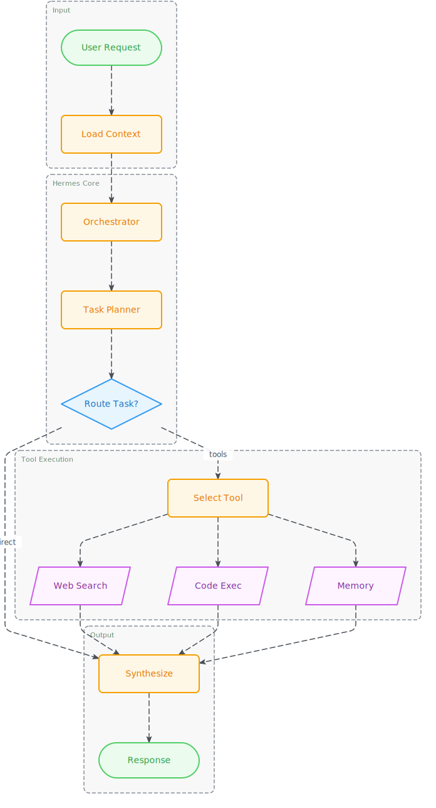
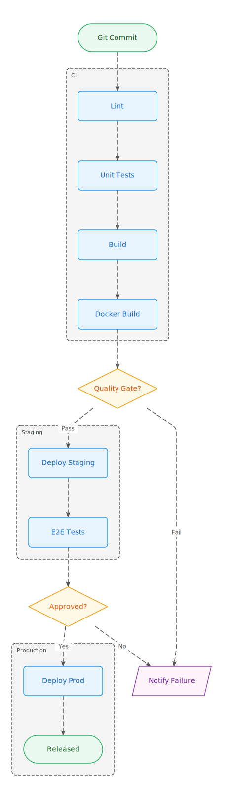
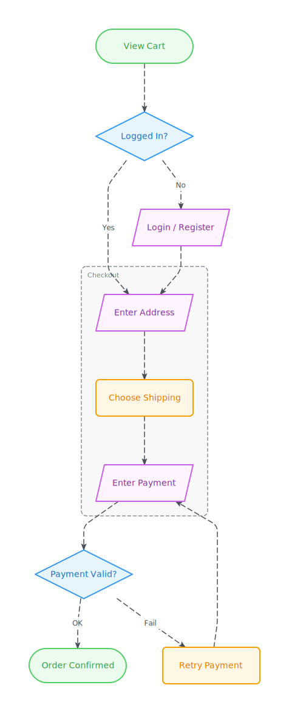

# ai-figure

> Clean SVG diagram renderer — define config, get beautiful diagrams. Works in browser **and** Node.js.

[](https://www.npmjs.com/package/ai-figure)
[](https://github.com/hustcc/ai-figure/actions/workflows/build.yml)
[](LICENSE)

|  |  |  |
|:---:|:---:|:---:|
| Hermes Agent | CI Pipeline | E-commerce Checkout |

## Features ✨

- 🎨 **Clean style** — clean crisp shapes, Inter font, modern color palette
- 📐 **Auto layout** — powered by [Dagre](https://github.com/dagrejs/dagre), no manual coordinates
- 📦 **Groups** — logical node groups rendered with dashed borders and labels
- 🌐 **Browser + Node.js** — pure SVG output, zero DOM dependency
- 🤖 **AI-friendly API** — single `fig()` entry point, semantic JSON config, TypeScript-first
- 🎭 **Two themes** — `excalidraw` (colorful) or `clean` (minimal)
- 📊 **Four diagram types** — flowchart, tree, architecture, sequence

---

## Quick Start

### Install

```bash
npm install ai-figure
```

### Usage

```typescript
import { fig } from 'ai-figure';

// Flowchart
const svg = fig({
  figure: 'flow',
  nodes: [
    { id: 'start',    label: 'Start',        type: 'terminal' },
    { id: 'process1', label: 'Process Data', type: 'process'  },
    { id: 'decision', label: 'Is Valid?',    type: 'decision' },
    { id: 'end_yes',  label: 'Success',      type: 'terminal' },
    { id: 'end_no',   label: 'Failure',      type: 'terminal' },
  ],
  edges: [
    { from: 'start',    to: 'process1'              },
    { from: 'process1', to: 'decision'              },
    { from: 'decision', to: 'end_yes', label: 'Yes' },
    { from: 'decision', to: 'end_no',  label: 'No'  },
  ],
  groups: [
    { id: 'g1', label: 'Validation', nodes: ['process1', 'decision'] },
  ],
  theme: 'excalidraw', // 'excalidraw' | 'clean'
  direction: 'TB',     // 'TB' (top→bottom) | 'LR' (left→right)
});

// Browser: inject into the DOM
document.body.innerHTML = svg;

// Node.js: write to file
import { writeFileSync } from 'fs';
writeFileSync('diagram.svg', svg);
```

---

## API Reference

### `fig(options): string`

The single entry point. Returns a fully self-contained SVG string. Select the diagram type with the required `figure` field.

```typescript
import { fig } from 'ai-figure';

fig({ figure: 'flow',     ...flowOptions     }); // flowchart
fig({ figure: 'tree',     ...treeOptions     }); // tree / hierarchy
fig({ figure: 'arch',     ...archOptions     }); // architecture diagram
fig({ figure: 'sequence', ...sequenceOptions }); // sequence diagram
```

---

### `figure: 'flow'` — Flowchart

| Field       | Type            | Default        | Description                              |
|-------------|-----------------|----------------|------------------------------------------|
| `figure`    | `'flow'`        | **required**   | Selects the flowchart renderer           |
| `nodes`     | `FlowNode[]`    | **required**   | List of nodes                            |
| `edges`     | `FlowEdge[]`    | **required**   | List of directed edges                   |
| `groups`    | `FlowGroup[]`   | `[]`           | Optional logical groups                  |
| `theme`     | `ThemeType`     | `'excalidraw'` | Visual theme                             |
| `direction` | `Direction`     | `'TB'`         | Layout direction (`'TB'` or `'LR'`)      |

#### `FlowNode`

| Field   | Type       | Default      | Description                |
|---------|------------|--------------|----------------------------|
| `id`    | `string`   | **required** | Unique node identifier     |
| `label` | `string`   | **required** | Text displayed in the node |
| `type`  | `NodeType` | `'process'`  | Visual shape               |

**Node types (`NodeType`)**

| Value      | Shape               | Use case                  |
|------------|---------------------|---------------------------|
| `process`  | Rectangle           | Default step / action     |
| `decision` | Diamond             | Conditional / branch      |
| `terminal` | Rounded rectangle   | Start / End               |
| `io`       | Parallelogram       | Input / Output            |

#### `FlowEdge`

| Field   | Type     | Default      | Description         |
|---------|----------|--------------|---------------------|
| `from`  | `string` | **required** | Source node ID      |
| `to`    | `string` | **required** | Target node ID      |
| `label` | `string` | `undefined`  | Optional edge label |

#### `FlowGroup`

| Field   | Type       | Default      | Description                        |
|---------|------------|--------------|------------------------------------|
| `id`    | `string`   | **required** | Unique group identifier            |
| `label` | `string`   | **required** | Label shown above the group border |
| `nodes` | `string[]` | **required** | IDs of nodes inside this group     |

---

### `figure: 'tree'` — Tree Diagram

Renders a hierarchy from a flat node list with `parent` references. Uses Dagre for layout.

| Field       | Type          | Default        | Description                        |
|-------------|---------------|----------------|------------------------------------|
| `figure`    | `'tree'`      | **required**   | Selects the tree renderer          |
| `nodes`     | `TreeNode[]`  | **required**   | Flat list with optional parent ref |
| `theme`     | `ThemeType`   | `'excalidraw'` | Visual theme                       |
| `direction` | `Direction`   | `'TB'`         | Layout direction                   |

```typescript
fig({
  figure: 'tree',
  nodes: [
    { id: 'ceo', label: 'CEO' },
    { id: 'cto', label: 'CTO', parent: 'ceo' },
    { id: 'coo', label: 'COO', parent: 'ceo' },
  ],
  theme: 'clean',
});
```

---

### `figure: 'arch'` — Architecture Diagram

Renders a tech-stack landscape as layered, color-coded cards — no edges needed.

| Field       | Type          | Default        | Description                              |
|-------------|---------------|----------------|------------------------------------------|
| `figure`    | `'arch'`      | **required**   | Selects the architecture renderer        |
| `layers`    | `ArchLayer[]` | **required**   | Layers from top to bottom (TB) or left to right (LR) |
| `theme`     | `ThemeType`   | `'excalidraw'` | Visual theme                             |
| `direction` | `Direction`   | `'TB'`         | `'TB'` = layers stacked, `'LR'` = layers side-by-side |
| `width`     | `number`      | `800`          | Total diagram width in pixels            |

```typescript
fig({
  figure: 'arch',
  layers: [
    { id: 'fe', label: 'Frontend', nodes: [{ id: 'react', label: 'React' }, { id: 'vue', label: 'Vue' }] },
    { id: 'be', label: 'Backend',  nodes: [{ id: 'node', label: 'Node.js' }] },
  ],
  width: 800,
});
```

---

### `figure: 'sequence'` — Sequence Diagram

Renders a sequence diagram with vertical lifelines and horizontal message arrows.

| Field      | Type           | Default        | Description                           |
|------------|----------------|----------------|---------------------------------------|
| `figure`   | `'sequence'`   | **required**   | Selects the sequence renderer         |
| `actors`   | `string[]`     | **required**   | Ordered list of participant names     |
| `messages` | `SeqMessage[]` | **required**   | Ordered list of message arrows        |
| `theme`    | `ThemeType`    | `'excalidraw'` | Visual theme                          |

```typescript
fig({
  figure: 'sequence',
  actors: ['Browser', 'API', 'DB'],
  messages: [
    { from: 'Browser', to: 'API', label: 'POST /login' },
    { from: 'API',     to: 'DB',  label: 'SELECT user' },
    { from: 'DB',      to: 'API', label: 'user row',  style: 'return' },
    { from: 'API',     to: 'Browser', label: '200 OK', style: 'return' },
  ],
});
```

---

## Examples

### Decision branch (flowchart)

```typescript
const svg = fig({
  figure: 'flow',
  nodes: [
    { id: 'start',    label: 'Start',     type: 'terminal' },
    { id: 'proc',     label: 'Process',   type: 'process'  },
    { id: 'decision', label: 'Is Valid?', type: 'decision' },
    { id: 'ok',       label: 'Success',   type: 'terminal' },
    { id: 'fail',     label: 'Failure',   type: 'terminal' },
  ],
  edges: [
    { from: 'start',    to: 'proc'                 },
    { from: 'proc',     to: 'decision'             },
    { from: 'decision', to: 'ok',   label: 'Yes'  },
    { from: 'decision', to: 'fail', label: 'No'   },
  ],
});
```

### Org chart (tree)

```typescript
const svg = fig({
  figure: 'tree',
  nodes: [
    { id: 'ceo',  label: 'CEO' },
    { id: 'cto',  label: 'CTO', parent: 'ceo' },
    { id: 'coo',  label: 'COO', parent: 'ceo' },
    { id: 'fe',   label: 'FE Lead', parent: 'cto' },
    { id: 'be',   label: 'BE Lead', parent: 'cto' },
  ],
  theme: 'clean',
});
```

### Full-stack architecture

```typescript
const svg = fig({
  figure: 'arch',
  layers: [
    { id: 'fe', label: 'Frontend', nodes: [{ id: 'react', label: 'React' }, { id: 'vue', label: 'Vue' }] },
    { id: 'be', label: 'Backend',  nodes: [{ id: 'node',  label: 'Node.js' }, { id: 'go', label: 'Go' }] },
    { id: 'db', label: 'Data',     nodes: [{ id: 'pg',    label: 'PostgreSQL' }] },
  ],
});
```

---

## Using with AI

This library ships a **[`SKILL.md`](./SKILL.md)** — a machine-readable skill file that AI agents (Copilot, Cursor, Claude, etc.) can load as context. It contains YAML frontmatter metadata, complete guides on how to generate configs for every diagram type, and full TypeScript type references.

```
# Load the skill into your AI context:
@SKILL.md
```

**Prompt example:**
> "Draw a flowchart showing the user login process: start → enter credentials → validate → if valid go to dashboard, if invalid show error → end."

**AI-generated code:**
```typescript
import { fig } from 'ai-figure';

const svg = fig({
  figure: 'flow',
  nodes: [
    { id: 'start',       label: 'Start',             type: 'terminal' },
    { id: 'credentials', label: 'Enter Credentials', type: 'io'       },
    { id: 'validate',    label: 'Validate',          type: 'process'  },
    { id: 'check',       label: 'Valid?',            type: 'decision' },
    { id: 'dashboard',   label: 'Go to Dashboard',  type: 'terminal' },
    { id: 'error',       label: 'Show Error',        type: 'terminal' },
  ],
  edges: [
    { from: 'start',       to: 'credentials'                  },
    { from: 'credentials', to: 'validate'                     },
    { from: 'validate',    to: 'check'                        },
    { from: 'check',       to: 'dashboard', label: 'Valid'    },
    { from: 'check',       to: 'error',     label: 'Invalid'  },
  ],
  theme: 'excalidraw',
  direction: 'TB',
});
```

---

## Development

```bash
# Install dependencies
npm install

# Build (ESM + CJS)
npm run build

# Run tests
npm test

# Type check
npm run typecheck

# Start browser demo (after building)
npx serve .
# Then open: http://localhost:3000/index.html
```

---

## License

MIT © [hustcc](https://github.com/hustcc)

