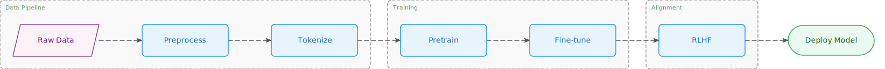

# ai-flowchart

> Clean SVG flowchart renderer — define nodes & edges, get beautiful diagrams. Works in browser **and** Node.js.

[](https://www.npmjs.com/package/ai-flowchart)
[](LICENSE)



---

## Features ✨

- 🎨 **Figcraft-inspired style** — clean crisp shapes, Inter font, modern color palette
- 📐 **Auto layout** — powered by [Dagre](https://github.com/dagrejs/dagre), no manual coordinates
- 📦 **Groups** — logical node groups rendered with dashed borders and labels
- 🌐 **Browser + Node.js** — pure SVG output, zero DOM dependency
- 🤖 **AI-friendly API** — simple, semantic, TypeScript-first
- 🎭 **Two themes** — `excalidraw` (colorful) or `clean` (minimal)

---

## Quick Start

### Install

```bash
npm install ai-flowchart
```

### Usage

```typescript
import { createFlowChart } from 'ai-flowchart';

const svg = createFlowChart({
  nodes: [
    { id: 'start',    label: 'Start',        type: 'terminal' },
    { id: 'process1', label: 'Process Data', type: 'process'  },
    { id: 'decision', label: 'Is Valid?',    type: 'decision' },
    { id: 'end_yes',  label: 'Success',      type: 'terminal' },
    { id: 'end_no',   label: 'Failure',      type: 'terminal' },
  ],
  edges: [
    { from: 'start',    to: 'process1'              },
    { from: 'process1', to: 'decision'              },
    { from: 'decision', to: 'end_yes', label: 'Yes' },
    { from: 'decision', to: 'end_no',  label: 'No'  },
  ],
  groups: [
    { id: 'g1', label: 'Validation', nodes: ['process1', 'decision'] },
  ],
  theme: 'excalidraw', // 'excalidraw' | 'clean'
  direction: 'TB',     // 'TB' (top→bottom) | 'LR' (left→right)
});

// Browser: inject into the DOM
document.body.innerHTML = svg;

// Node.js: write to file
import { writeFileSync } from 'fs';
writeFileSync('flowchart.svg', svg);
```

---

## API Reference

### `createFlowChart(options): string`

Returns an SVG string. All layout is computed automatically.

#### `FlowChartOptions`

| Field       | Type            | Default        | Description                              |
|-------------|-----------------|----------------|------------------------------------------|
| `nodes`     | `FlowNode[]`    | **required**   | List of nodes                            |
| `edges`     | `FlowEdge[]`    | **required**   | List of directed edges                   |
| `groups`    | `FlowGroup[]`   | `[]`           | Optional logical groups                  |
| `theme`     | `ThemeType`     | `'excalidraw'` | Visual theme (`'excalidraw'` or `'clean'`) |
| `direction` | `Direction`     | `'TB'`         | Layout direction (`'TB'` or `'LR'`)       |

---

#### `FlowNode`

| Field   | Type       | Default     | Description                |
|---------|------------|-------------|----------------------------|
| `id`    | `string`   | **required** | Unique node identifier     |
| `label` | `string`   | **required** | Text displayed in the node |
| `type`  | `NodeType` | `'process'` | Visual shape               |

**Node types (`NodeType`)**

| Value      | Shape               | Use case                  |
|------------|---------------------|---------------------------|
| `process`  | Rectangle           | Default step / action     |
| `decision` | Diamond             | Conditional / branch      |
| `terminal` | Rounded rectangle   | Start / End               |
| `io`       | Parallelogram       | Input / Output            |

---

#### `FlowEdge`

| Field   | Type     | Default      | Description              |
|---------|----------|--------------|--------------------------|
| `from`  | `string` | **required** | Source node ID           |
| `to`    | `string` | **required** | Target node ID           |
| `label` | `string` | `undefined`  | Optional edge label      |

---

#### `FlowGroup`

| Field   | Type       | Default      | Description                        |
|---------|------------|--------------|------------------------------------|
| `id`    | `string`   | **required** | Unique group identifier            |
| `label` | `string`   | **required** | Label shown above the group border |
| `nodes` | `string[]` | **required** | IDs of nodes inside this group     |

---

## Examples

### Simple linear flow

```typescript
const svg = createFlowChart({
  nodes: [
    { id: 'a', label: 'Start',   type: 'terminal' },
    { id: 'b', label: 'Process', type: 'process'  },
    { id: 'c', label: 'End',     type: 'terminal' },
  ],
  edges: [
    { from: 'a', to: 'b' },
    { from: 'b', to: 'c' },
  ],
});
```

---

### Decision branch

```typescript
const svg = createFlowChart({
  nodes: [
    { id: 'start',    label: 'Start',        type: 'terminal' },
    { id: 'proc',     label: 'Process',      type: 'process'  },
    { id: 'decision', label: 'Is Valid?',    type: 'decision' },
    { id: 'ok',       label: 'Success',      type: 'terminal' },
    { id: 'fail',     label: 'Failure',      type: 'terminal' },
  ],
  edges: [
    { from: 'start',    to: 'proc'                 },
    { from: 'proc',     to: 'decision'             },
    { from: 'decision', to: 'ok',   label: 'Yes'  },
    { from: 'decision', to: 'fail', label: 'No'   },
  ],
});
```

---

### Groups + clean theme + horizontal layout

```typescript
const svg = createFlowChart({
  nodes: [
    { id: 'input',   label: 'User Input',   type: 'io'       },
    { id: 'parse',   label: 'Parse',        type: 'process'  },
    { id: 'valid',   label: 'Valid?',       type: 'decision' },
    { id: 'store',   label: 'Store in DB',  type: 'process'  },
    { id: 'error',   label: 'Return Error', type: 'terminal' },
  ],
  edges: [
    { from: 'input', to: 'parse'              },
    { from: 'parse', to: 'valid'              },
    { from: 'valid', to: 'store', label: '✓' },
    { from: 'valid', to: 'error', label: '✗' },
  ],
  groups: [
    { id: 'g1', label: 'Validation Layer', nodes: ['parse', 'valid'] },
  ],
  theme: 'clean',
  direction: 'LR',
});
```

---

## Using with AI

This library ships a **[`SKILL.md`](./SKILL.md)** — a machine-readable skill file that AI agents (Copilot, Cursor, Claude, etc.) can load as context. It contains YAML frontmatter metadata, a complete guide on how to generate the JSON config, node-type rules, and the full TypeScript type reference. Point your AI at it and it will produce correct configs without any manual prompting.

```
# Load the skill into your AI context:
@SKILL.md
```

This API is designed to be easy for AI agents to call. Just describe the flow in natural language and ask the AI to generate the `createFlowChart(...)` call.

**Prompt example:**
> "Draw a flowchart showing the user login process: start → enter credentials → validate → if valid go to dashboard, if invalid show error → end."

**AI-generated code:**
```typescript
import { createFlowChart } from 'ai-flowchart';

const svg = createFlowChart({
  nodes: [
    { id: 'start',       label: 'Start',             type: 'terminal' },
    { id: 'credentials', label: 'Enter Credentials', type: 'io'       },
    { id: 'validate',    label: 'Validate',          type: 'process'  },
    { id: 'check',       label: 'Valid?',            type: 'decision' },
    { id: 'dashboard',   label: 'Go to Dashboard',  type: 'terminal' },
    { id: 'error',       label: 'Show Error',        type: 'terminal' },
  ],
  edges: [
    { from: 'start',       to: 'credentials'                    },
    { from: 'credentials', to: 'validate'                       },
    { from: 'validate',    to: 'check'                         },
    { from: 'check',       to: 'dashboard', label: 'Valid'     },
    { from: 'check',       to: 'error',     label: 'Invalid'   },
  ],
  theme: 'excalidraw',
  direction: 'TB',
});
```

---

## Development

```bash
# Install dependencies
npm install

# Build (ESM + CJS)
npm run build

# Run tests
npm test

# Type check
npm run typecheck

# Start browser demo (after building)
npx serve .
# Then open: http://localhost:3000/index.html
```

---

## License

MIT © [hustcc](https://github.com/hustcc)

